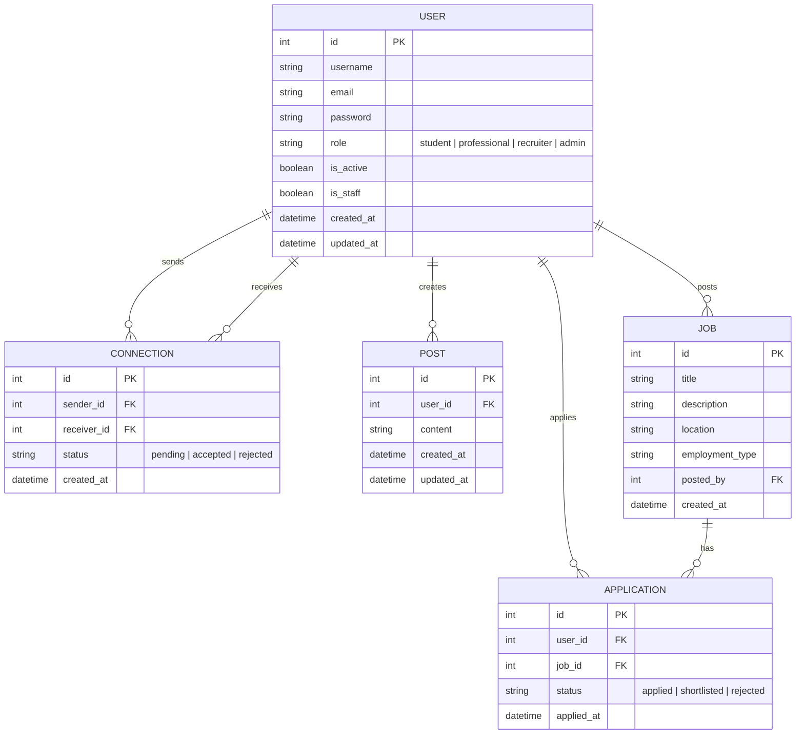

```mermaid
erDiagram
    USER {
        int id PK
        string username
        string email
        string password
        string role  "student | professional | recruiter | admin"
        boolean is_active
        boolean is_staff
        datetime created_at
        datetime updated_at
    }

    CONNECTION {
        int id PK
        int sender_id FK
        int receiver_id FK
        string status  "pending | accepted | rejected"
        datetime created_at
    }

    POST {
        int id PK
        int user_id FK
        string content
        datetime created_at
        datetime updated_at
    }

    JOB {
        int id PK
        string title
        string description
        string location
        string employment_type
        int posted_by FK
        datetime created_at
    }

    APPLICATION {
        int id PK
        int user_id FK
        int job_id FK
        string status  "applied | shortlisted | rejected"
        datetime applied_at
    }

    USER ||--o{ POST : creates
    USER ||--o{ JOB : posts
    USER ||--o{ APPLICATION : applies
    JOB  ||--o{ APPLICATION : has

    USER ||--o{ CONNECTION : sends
    USER ||--o{ CONNECTION : receives

```
